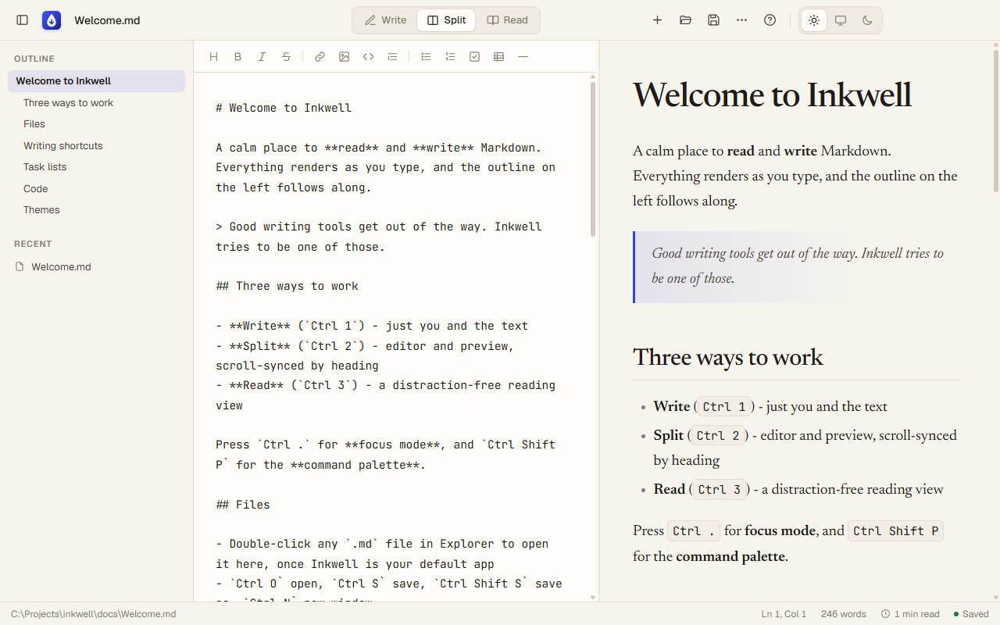
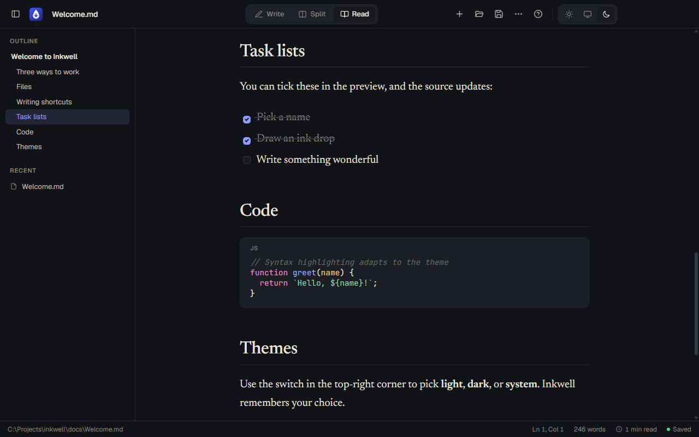
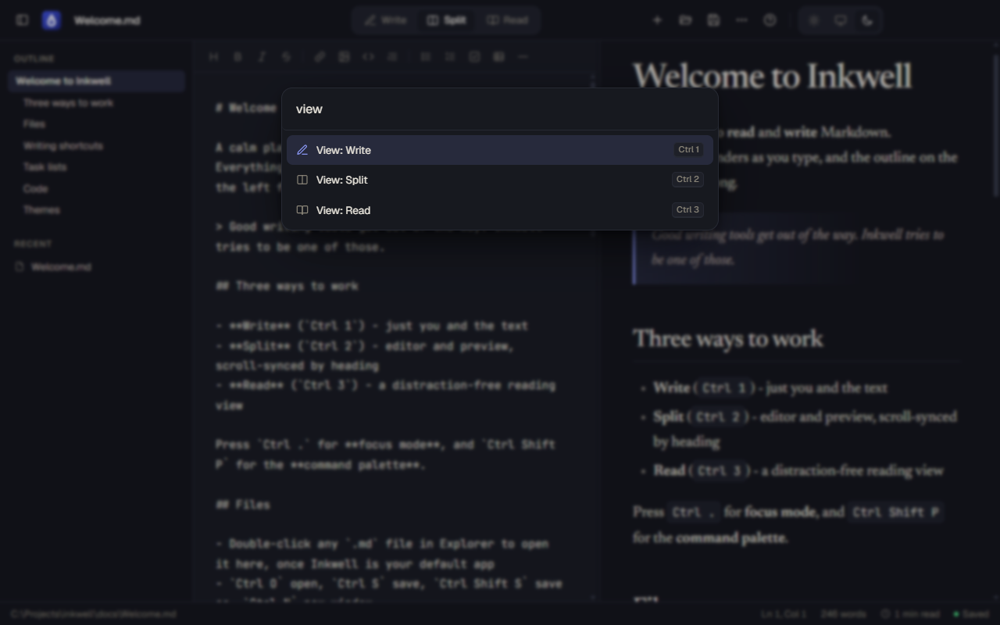
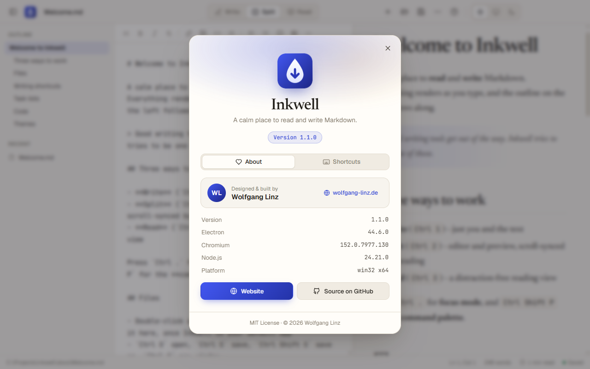
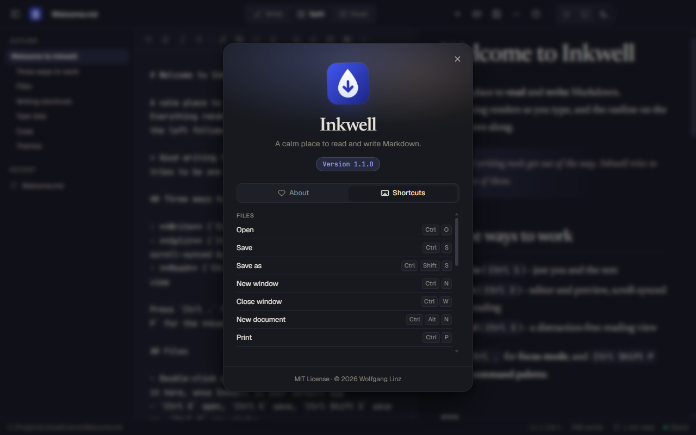

<div align="center">


# Inkwell

**A calm place to read and write Markdown.**

A fast, good-looking Markdown editor and reader for **Windows and macOS**, with its own window, light and dark themes, and double-click to open your `.md` files.

[](https://github.com/wl-lankin/inkwell/releases/latest)
[](LICENSE)


[**Download for Windows**](https://github.com/wl-lankin/inkwell/releases/latest) · [**Download for macOS**](https://github.com/wl-lankin/inkwell/releases/latest) · [Features](#-features) · [Shortcuts](#%EF%B8%8F-keyboard-shortcuts) · [Build from source](#%EF%B8%8F-build-from-source)

<br>



</div>

<br>

<table>
  <tr>
    <td width="50%"></td>
    <td width="50%"></td>
  </tr>
  <tr>
    <td align="center"><sub><b>Read view</b>, dark theme</sub></td>
    <td align="center"><sub><b>Command palette</b> (<code>Ctrl Shift P</code>)</sub></td>
  </tr>
  <tr>
    <td width="50%"></td>
    <td width="50%"></td>
  </tr>
  <tr>
    <td align="center"><sub><b>About</b> (<code>F1</code>)</sub></td>
    <td align="center"><sub><b>Shortcuts</b> cheat sheet</sub></td>
  </tr>
</table>

## ✨ Features

**Three ways to work**
- **Write** for distraction-free drafting, **Split** for editor and live preview side by side, **Read** for typeset reading
- Split view scroll-syncs **by heading**, so both sides stay on the same section
- **Focus mode** hides everything but your words

**A real desktop app**
- Its own window with a themed title bar, not a browser tab
- Feels native on both platforms: on macOS you get traffic-light window buttons, a full menu bar, `⌘` shortcuts, a Recent Documents menu, and it stays in the Dock when you close the last window
- Registers for `.md`, `.markdown`, `.mdown`, `.mkd` and `.mkdn`, so you can make it your default and double-click to open
- One window per document. Opening a file that's already open brings its window to the front.
- Asks before closing with unsaved changes
- Reloads automatically when another program changes the open file
- Relative images and links to other `.md` files just work

**Writing comfort**
- Formatting toolbar and shortcuts for bold, italic, links, code, headings, lists, tasks, tables and dividers
- Lists continue on Enter, Tab and Shift+Tab indent, and pasting a URL over selected text makes a link
- Tick task-list checkboxes **in the preview**, and the Markdown source updates
- Outline sidebar that tracks where you are, plus recent files

**Beautiful output**
- GitHub-flavored Markdown with syntax highlighting that adapts to the theme
- Carefully set typography: *Newsreader* for reading, *JetBrains Mono* for writing, *Geist* for the interface
- Export to **PDF** or **HTML**, copy as rich text, or print

**Light, dark and system themes**
- Switch instantly, and Inkwell remembers your choice. Even the window controls follow the theme.

**Private by design**
- Fully offline: fonts and libraries are bundled. No accounts, no telemetry, and your files stay on your disk.

## 📦 Install

Grab the latest version from the [**Releases page**](https://github.com/wl-lankin/inkwell/releases/latest).

### Windows 10 / 11

1. Download **`Inkwell-Setup-x.y.z.exe`** and run it. Inkwell installs for your user only (no admin rights needed) and adds Start Menu and Desktop shortcuts.
2. **Make it your default Markdown app:** right-click any `.md` file, choose **Open with > Choose another app > Inkwell**, then click **Always**.

> [!NOTE]
> The installer isn't code-signed yet, so Windows SmartScreen may warn you the first time. Click **More info > Run anyway**.

### macOS 12 or newer (Apple Silicon and Intel)

1. Download **`Inkwell-x.y.z-mac-universal.dmg`**, open it, and drag **Inkwell** into **Applications**.
2. **First launch:** Inkwell isn't notarized by Apple yet, so macOS blocks it the first time. Open it once, then go to **System Settings > Privacy & Security** and click **Open Anyway**. You can also run this once in Terminal:
   ```bash
   xattr -dr com.apple.quarantine /Applications/Inkwell.app
   ```
3. **Make it your default Markdown app:** select any `.md` file in Finder, press **⌘ I** (Get Info), choose **Inkwell** under **Open with**, then click **Change All…**.

## ⌨️ Keyboard shortcuts

On macOS, use **⌘** wherever the table says `Ctrl`. The one exception is **Cycle heading**, which is **⌃ H** on a Mac, because ⌘ H hides apps there.

| Files | | View | | Formatting | |
| --- | --- | --- | --- | --- | --- |
| Open | `Ctrl O` | Write / Split / Read | `Ctrl 1` `2` `3` | Bold | `Ctrl B` |
| Save | `Ctrl S` | Focus mode | `Ctrl .` | Italic | `Ctrl I` |
| Save as | `Ctrl Shift S` | Sidebar | `Ctrl Shift B` | Link | `Ctrl K` |
| New window | `Ctrl N` | Command palette | `Ctrl Shift P` | Inline code | `Ctrl E` |
| Close window | `Ctrl W` | About & shortcuts | `F1` | Cycle heading | `Ctrl H` |
| New document | `Ctrl Alt N` | | | Strikethrough | `Ctrl Shift X` |

## 🛠️ Build from source

You need [Node.js](https://nodejs.org) 20 or newer.

```bash
git clone https://github.com/wl-lankin/inkwell.git
cd inkwell
npm install
npm start                    # run the app
npm start -- notes.md        # run the app with a file
npm run dist                 # Windows installer into dist/ (re-renders icons first)
npm run dist:mac             # macOS universal .dmg + .zip (run this on a Mac)
```

### Releases

Pushing a version tag (for example `v1.2.0`) starts the [Release workflow](.github/workflows/release.yml). It builds the Windows installer and a universal macOS app on GitHub's runners, smoke-tests the Mac build, and attaches everything to the GitHub release.

> [!TIP]
> If npm blocks Electron's install script, run `node node_modules/electron/install.js` once.

`npm run icon` renders the app and file icons from SVG into `.ico` (Windows) and `.icns` (macOS). The installers are packaged with `electron-builder`.

You can also open `index.html` in Chrome or Edge without Electron. In that mode Inkwell uses the File System Access API and autosaves drafts locally.

### Project layout

| Path | Purpose |
| --- | --- |
| `index.html` · `styles.css` · `app.js` | The UI: editor, preview, outline, palette, themes |
| `electron/main.js` | Windows, file associations, file I/O, close prompts, file watching, PDF export, macOS menu |
| `electron/preload.js` | The narrow, context-isolated bridge (`window.inkwellNative`) |
| `scripts/build-icon.js` | Renders the SVG icons to `.ico` and `.icns` (`build/icon-mac.svg` follows the macOS icon grid) |
| `vendor/` | [marked](https://marked.js.org), [DOMPurify](https://github.com/cure53/DOMPurify), [highlight.js](https://highlightjs.org) |

### Security

Markdown is rendered with `marked` and sanitized with DOMPurify before it reaches the page. The renderer runs sandboxed with context isolation and a strict Content Security Policy, and links open in your default browser.

## 📄 License

[MIT](LICENSE) © 2026 [Wolfgang Linz](https://wolfgang-linz.de)

<div align="center">
<br>
<sub>Made with care by <a href="https://wolfgang-linz.de">Wolfgang Linz</a></sub>
</div>
